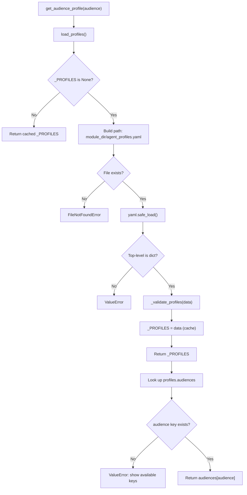

# Agent Profiles Loader – Visual

## Flow: Getter → load → validate → cache

```mermaid
flowchart TD
  A["get_audience_profile(audience)"] --> B["load_profiles()"]
  B --> C{_PROFILES is None?}

  C -- No --> D[Return cached _PROFILES]
  C -- Yes --> E["Build path: module_dir/agent_profiles.yaml"]
  E --> F{File exists?}
  F -- No --> G[FileNotFoundError]
  F -- Yes --> H["yaml.safe_load()"]
  H --> I{Top-level is dict?}
  I -- No --> J[ValueError]
  I -- Yes --> K["_validate_profiles(data)"]
  K --> L["_PROFILES = data (cache)"]
  L --> M[Return _PROFILES]

  M --> N[Look up profiles.audiences]
  N --> O{audience key exists?}
  O -- No --> P[ValueError: show available keys]
  O -- Yes --> Q["Return audiences[audience]"]
```
