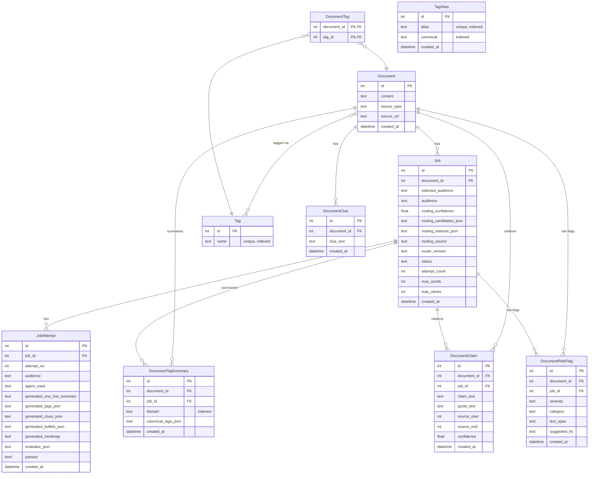
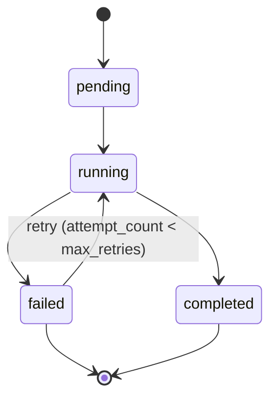

# Database Schema – Visual (Updated)

## Entity Relationship Diagram



---

## Table Summary

```
Tables & Relationships
│
├── Document                   Core content record
│   ├── id (PK)
│   ├── content
│   ├── source_type
│   ├── source_url
│   └── created_at
│       │
│       ├──< Job                One document -> many jobs
│       │     ├── id (PK)
│       │     ├── document_id (FK -> Document.id)  [indexed]
│       │     ├── selected_audience
│       │     ├── audience
│       │     ├── routing_confidence
│       │     ├── routing_candidates_json
│       │     ├── routing_reasons_json
│       │     ├── routing_source
│       │     ├── router_version
│       │     ├── status
│       │     ├── attempt_count
│       │     ├── max_words
│       │     ├── max_retries
│       │     └── created_at
│       │           │
│       │           └──< JobAttempt      One job -> many attempts
│       │                 ├── id (PK)
│       │                 ├── job_id (FK -> Job.id)  [indexed]
│       │                 ├── attempt_no
│       │                 ├── audience
│       │                 ├── agent_used
│       │                 ├── generated_one_line_summary
│       │                 ├── generated_tags_json
│       │                 ├── generated_clues_json
│       │                 ├── generated_bullets_json
│       │                 ├── generated_mindmap
│       │                 ├── evaluator_json
│       │                 ├── passed
│       │                 └── created_at
│       │
│       ├──< DocumentClue       One document -> many clues
│       │     ├── id (PK)
│       │     ├── document_id (FK -> Document.id)  [indexed]
│       │     ├── clue_text
│       │     └── created_at
│       │
│       ├──< DocumentTagSummary  One document -> many tag summaries
│       │     ├── id (PK)
│       │     ├── document_id (FK -> Document.id)  [indexed]
│       │     ├── job_id (FK -> Job.id)           [indexed]
│       │     ├── domain                          [indexed]
│       │     ├── canonical_tags_json
│       │     └── created_at
│       │
│       ├──< DocumentClaim       One document -> many citation claims
│       │     ├── id (PK)
│       │     ├── document_id (FK -> Document.id)  [indexed]
│       │     ├── job_id (FK -> Job.id)            [indexed]
│       │     ├── claim_text
│       │     ├── quote_text
│       │     ├── source_start
│       │     ├── source_end
│       │     ├── confidence
│       │     └── created_at
│       │
│       ├──< DocumentRiskFlag    One document -> many risk flags
│       │     ├── id (PK)
│       │     ├── document_id (FK -> Document.id)  [indexed]
│       │     ├── job_id (FK -> Job.id)            [indexed]
│       │     ├── severity
│       │     ├── category
│       │     ├── text_span
│       │     ├── suggested_fix
│       │     └── created_at
│       │
│       └──< DocumentTag        Join table (many-to-many)
│             ├── document_id (PK, FK -> Document.id)  [indexed]
│             └── tag_id (PK, FK -> Tag.id)            [indexed]
│
├── Tag                         Global tag registry
│   ├── id (PK)
│   └── name  [unique, indexed]
│
└── TagAlias                    Tag normalization map
    ├── id (PK)
    ├── alias     [unique, indexed]
    ├── canonical [indexed]
    └── created_at
```

---

## Indexes

| Index Name                      | Table               | Column(s)     | Notes             |
|---------------------------------|---------------------|---------------|-------------------|
| `ix_job_document_id`            | job                 | document_id   | FK lookup         |
| `ix_jobattempt_job_id`          | jobattempt          | job_id        | FK lookup         |
| `ix_documentclue_document_id`   | documentclue        | document_id   | FK lookup         |
| `ix_documenttag_document_id`    | documenttag         | document_id   | FK lookup         |
| `ix_documenttag_tag_id`         | documenttag         | tag_id        | FK lookup         |
| `ix_tagalias_alias`             | tagalias            | alias         | FK lookup         |
| `ix_tagalias_canonical`         | tagalias            | canonical     | FK lookup         |
| `ix_doc_tag_summary_doc`        | documenttagsummary  | document_id   | FK lookup         |
| `ix_doc_tag_summary_job`        | documenttagsummary  | job_id        | FK lookup         |
| `ix_doc_tag_summary_domain`     | documenttagsummary  | domain        | Filter/sort       |
| `ix_doc_claim_doc`              | documentclaim       | document_id   | FK lookup         |
| `ix_doc_claim_job`              | documentclaim       | job_id        | FK lookup         |
| `ix_doc_risk_doc`               | documentriskflag    | document_id   | FK lookup         |
| `ix_doc_risk_job`               | documentriskflag    | job_id        | FK lookup         |
| _(auto)_                        | tag                 | name          | unique constraint |
| _(auto)_                        | tagalias            | alias         | unique constraint |

---

## Job Status Flow


