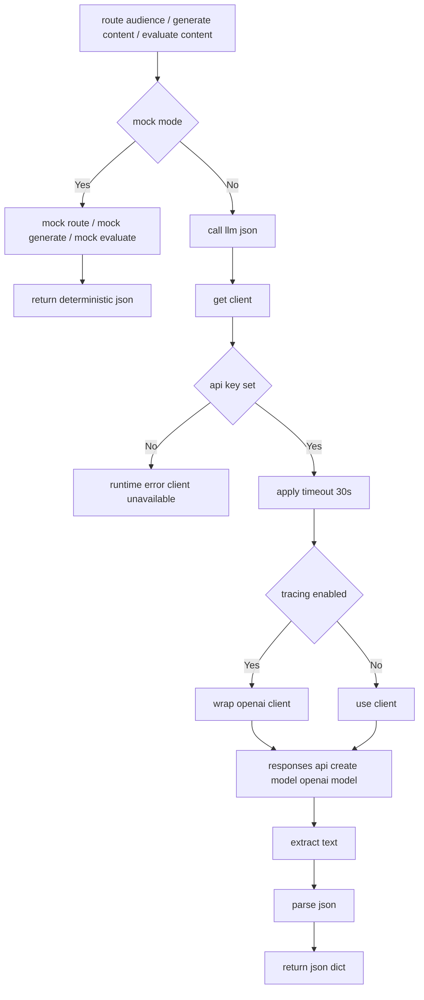

# llm.py visual

## Flow: Check mock → (mock result) OR (OpenAI call → extract text → parse JSON) → dict

```mermaid
flowchart TD
  A[route audience / generate content / evaluate content] --> B{mock mode}

  B -- Yes --> M1[mock route / mock generate / mock evaluate]
  M1 --> R1[return deterministic json]

  B -- No --> C[call llm json]
  C --> D[get client]
  D --> E{api key set}
  E -- No --> X[runtime error client unavailable]
  E -- Yes --> T[apply timeout 30s]
  T --> W{tracing enabled}
  W -- Yes --> W1[wrap openai client]
  W -- No --> W2[use client]
  W1 --> F[responses api create model openai model]
  W2 --> F
  F --> G[extract text]
  G --> H[parse json]
  H --> R2[return json dict]
```
